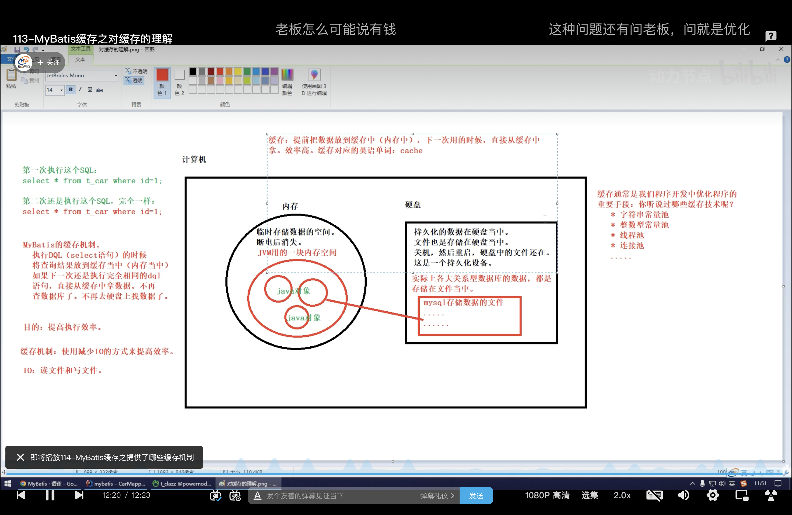

Mybatis缓存机制

### 缓存：




### Mybatis提供的缓存机制

#### 一级缓存

1. 存放在SqlSession中

2. 使用不同的mapper，只查询了一次

   ```java
       @Test
       public void testSelectByIdInSameSession(){
           SqlSession sqlSession = SqlSessionUtil.openSession();
           CarMapper mapper = sqlSession.getMapper(CarMapper.class);
           Car car = mapper.selectById(65L);
           System.out.println(car);
   
   
           CarMapper mapper1 = sqlSession.getMapper(CarMapper.class);
           Car car1 = mapper1.selectById(65L);
           System.out.println(car1);
           sqlSession.close();
       }
   
   ```

   ```txt
   2023-03-26 12:16:03.158 [main] DEBUG com.yty.mybatis.mapper.CarMapper.selectById - ==>  Preparing: select * from t_car where id= ?;
   2023-03-26 12:16:03.172 [main] DEBUG com.yty.mybatis.mapper.CarMapper.selectById - ==> Parameters: 65(Long)
   2023-03-26 12:16:03.184 [main] DEBUG com.yty.mybatis.mapper.CarMapper.selectById - <==      Total: 1
   Car{id=65, carnum=1231, brand='Audi Q2L E-tron', guidePrice=100.0, produceTime='2023-02-04', carType='ele'}
   Car{id=65, carnum=1231, brand='Audi Q2L E-tron', guidePrice=100.0, produceTime='2023-02-04', carType='ele'}
   ```

3. 如果使用不同的SqlSession，会查询多次，验证了一级缓存存放在SqlSession中

   ```java
       @Test
       public void testSelectById() throws IOException {
           SqlSessionFactory sqlSessionFactory = new SqlSessionFactoryBuilder().build(Resources.getResourceAsStream("mybatis-config.xml"));
           SqlSession sqlSession1 = sqlSessionFactory.openSession();
           CarMapper mapper1 = sqlSession1.getMapper(CarMapper.class);
           System.out.println(mapper1.selectById(65L));
   
           SqlSession sqlSession2 = sqlSessionFactory.openSession();
           CarMapper mapper2 = sqlSession2.getMapper(CarMapper.class);
           System.out.println(mapper2.selectById(65L));
           sqlSession1.close();
           sqlSession2.close();
       }
   ```

   ```txt
   2023-03-26 12:16:55.937 [main] DEBUG com.yty.mybatis.mapper.CarMapper.selectById - ==>  Preparing: select * from t_car where id= ?;
   2023-03-26 12:16:55.951 [main] DEBUG com.yty.mybatis.mapper.CarMapper.selectById - ==> Parameters: 65(Long)
   2023-03-26 12:16:55.964 [main] DEBUG com.yty.mybatis.mapper.CarMapper.selectById - <==      Total: 1
   Car{id=65, carnum=1231, brand='Audi Q2L E-tron', guidePrice=100.0, produceTime='2023-02-04', carType='ele'}
   2023-03-26 12:16:55.969 [main] DEBUG org.apache.ibatis.transaction.jdbc.JdbcTransaction - Opening JDBC Connection
   2023-03-26 12:16:55.982 [main] DEBUG o.apache.ibatis.datasource.pooled.PooledDataSource - Created connection 259630944.
   2023-03-26 12:16:55.983 [main] DEBUG org.apache.ibatis.transaction.jdbc.JdbcTransaction - Setting autocommit to false on JDBC Connection [com.mysql.cj.jdbc.ConnectionImpl@f79a760]
   2023-03-26 12:16:55.983 [main] DEBUG com.yty.mybatis.mapper.CarMapper.selectById - ==>  Preparing: select * from t_car where id= ?;
   2023-03-26 12:16:55.983 [main] DEBUG com.yty.mybatis.mapper.CarMapper.selectById - ==> Parameters: 65(Long)
   2023-03-26 12:16:55.984 [main] DEBUG com.yty.mybatis.mapper.CarMapper.selectById - <==      Total: 1
   Car{id=65, carnum=1231, brand='Audi Q2L E-tron', guidePrice=100.0, produceTime='2023-02-04', carType='ele'}
   
   ```

4. 不使用一级缓存的情况：

   1. 不同的SqlSession对象
   2. 查询条件不同

5. 缓存失效：

   1. 查询之间执行了两类行为会清空一级缓存：

      1. 执行了SqlSession的ClearCache方法

         ```java
             @Test
             public void testSelectByIdInSameSession(){
                 SqlSession sqlSession = SqlSessionUtil.openSession();
                 CarMapper mapper = sqlSession.getMapper(CarMapper.class);
                 Car car = mapper.selectById(65L);
                 System.out.println(car);
                 sqlSession.clearCache();
         
                 CarMapper mapper1 = sqlSession.getMapper(CarMapper.class);
                 Car car1 = mapper1.selectById(65L);
                 System.out.println(car1);
                 sqlSession.close();
             }
         ```

         ```
         2023-03-26 12:24:06.368 [main] DEBUG com.yty.mybatis.mapper.CarMapper.selectById - ==>  Preparing: select * from t_car where id= ?;
         2023-03-26 12:24:06.382 [main] DEBUG com.yty.mybatis.mapper.CarMapper.selectById - ==> Parameters: 65(Long)
         2023-03-26 12:24:06.395 [main] DEBUG com.yty.mybatis.mapper.CarMapper.selectById - <==      Total: 1
         Car{id=65, carnum=1231, brand='Audi Q2L E-tron', guidePrice=100.0, produceTime='2023-02-04', carType='ele'}
         2023-03-26 12:24:06.400 [main] DEBUG com.yty.mybatis.mapper.CarMapper.selectById - ==>  Preparing: select * from t_car where id= ?;
         2023-03-26 12:24:06.400 [main] DEBUG com.yty.mybatis.mapper.CarMapper.selectById - ==> Parameters: 65(Long)
         2023-03-26 12:24:06.401 [main] DEBUG com.yty.mybatis.mapper.CarMapper.selectById - <==      Total: 1
         Car{id=65, carnum=1231, brand='Audi Q2L E-tron', guidePrice=100.0, produceTime='2023-02-04', carType='ele'}
         ```

      2. 执行了Insert、Delete或Update语句，而且和表没有关系

         ```java
             @Test
             public void testSelectByCid(){
                 SqlSession sqlSession = SqlSessionUtil.openSession();
                 ClazzMapper mapper = sqlSession.getMapper(ClazzMapper.class);
                 Clazz clazz = mapper.selectByCid(1000);
                 System.out.println(clazz);
                 int count = mapper.insertClazz(1002, "NZ173");
                 sqlSession.commit();
                 Clazz clazz1 = mapper.selectByCid(1000);
                 System.out.println(clazz1);
                 sqlSession.close();
         
             }
         ```

         ```txt
         2023-03-26 12:32:41.138 [main] DEBUG com.yty.mybatis.mapper.ClazzMapper.selectByCid - ==>  Preparing: select * from t_clazz where cid=?;
         2023-03-26 12:32:41.152 [main] DEBUG com.yty.mybatis.mapper.ClazzMapper.selectByCid - ==> Parameters: 1000(Integer)
         2023-03-26 12:32:41.165 [main] DEBUG com.yty.mybatis.mapper.ClazzMapper.selectByCid - <==      Total: 1
         Clazz{cid=1000, cname='NZ 171', students=null}
         2023-03-26 12:32:41.167 [main] DEBUG com.yty.mybatis.mapper.ClazzMapper.insertClazz - ==>  Preparing: insert into t_clazz (cid, cname) values (?, ?);
         2023-03-26 12:32:41.167 [main] DEBUG com.yty.mybatis.mapper.ClazzMapper.insertClazz - ==> Parameters: 1002(Integer), NZ173(String)
         2023-03-26 12:32:41.177 [main] DEBUG com.yty.mybatis.mapper.ClazzMapper.insertClazz - <==    Updates: 1
         2023-03-26 12:32:41.177 [main] DEBUG org.apache.ibatis.transaction.jdbc.JdbcTransaction - Committing JDBC Connection [com.mysql.cj.jdbc.ConnectionImpl@38f116f6]
         2023-03-26 12:32:41.181 [main] DEBUG com.yty.mybatis.mapper.ClazzMapper.selectByCid - ==>  Preparing: select * from t_clazz where cid=?;
         2023-03-26 12:32:41.181 [main] DEBUG com.yty.mybatis.mapper.ClazzMapper.selectByCid - ==> Parameters: 1000(Integer)
         2023-03-26 12:32:41.182 [main] DEBUG com.yty.mybatis.mapper.ClazzMapper.selectByCid - <==      Total: 1
         Clazz{cid=1000, cname='NZ 171', students=null}
         
         ```

      3. 

#### 二级缓存

1. 存放在SqlSessionFactory中
2. 

#### 其他缓存工具

